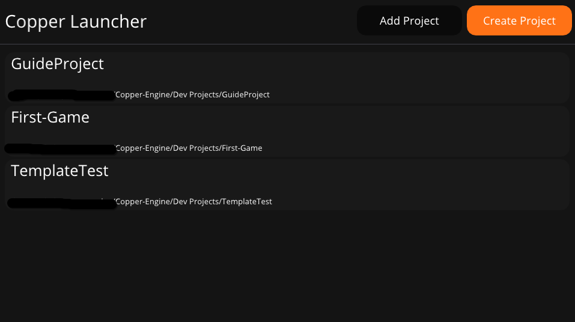
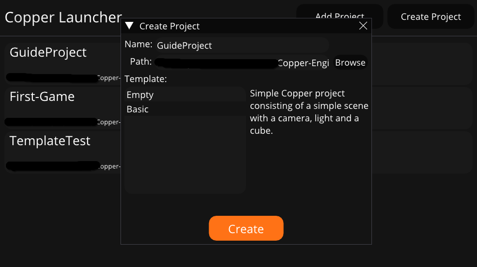

# Getting started
Welcome to Copper-Engine.

This guide will, well, guide you, through using and working with the Copper-Engine. We will go through every step and part of the engine from installing the editor and launcher, to coding your first Copper game.

## Download
First you will need to download and install the Copper-Editor.

**There is no installer at the moment, but one is in the works!**

## Creating a project
Now that you have the launcher and the editor, you can Launch the Copper-Launcher application.

This is where you create, manage and open your projects. In the future you will also be able to install and update the Copper-Editor. For now, press the big "Create Project" button in the top right corner.

This will open the Create Project dialog, where you can select the location, give the project a name, and select a project template.
The new project will create a folder in the path you provided, with the name of the Project.

Press the big fat Create button when you are ready. That should create the project, and open the Copper-Editor.