# Copper-Editor
In this guide you will learn the basic terminology and usage of the Copper-Editor, the level editor for Copper-Engine.

## Love at first sight
Upon creating a project you should see this window.

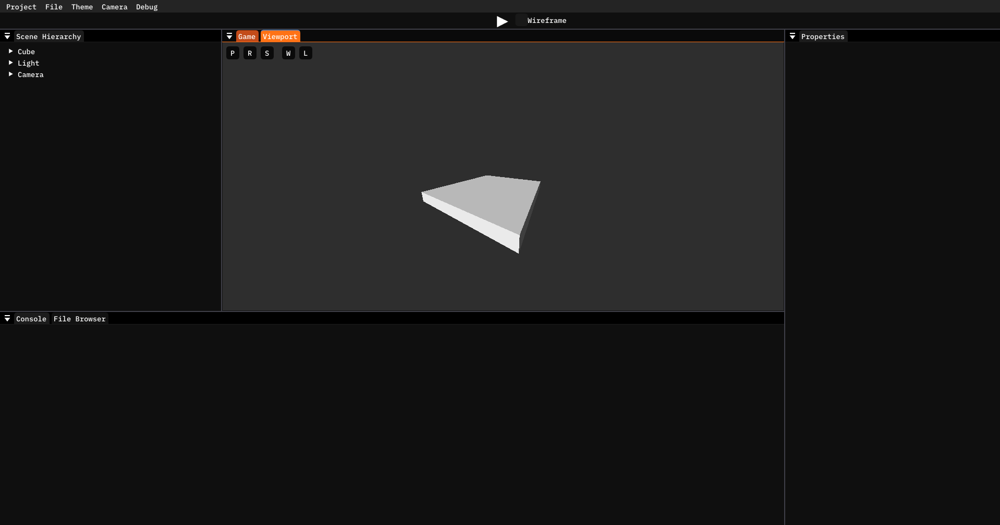

This is the Copper-Editor. It is made up of panels which can all be rearranged and resized to your liking.

### Viewport
Right in the middle of it all is the Viewport. 

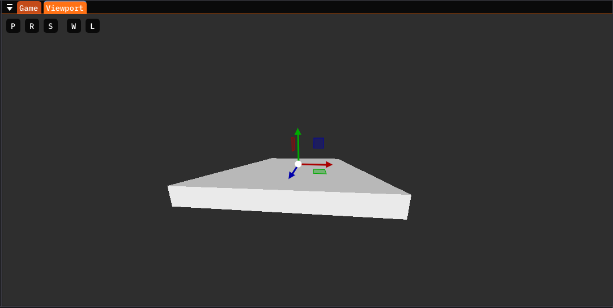

The Viewport serves as the eyes to the scene. You can fly around using WASD and your mouse by holding the right mouse button, you can select entities by clicking on them and you can move, rotate and scale them around using the gizmo arrows.

This is the panel that lets you create the game world, your biggest tool.

You can select the gizmo operation (move, rotate, scale) or the mode (global local) by either clicking on the buttons in the top left corner.

Or select the operation by pressing Q, W, or E.

NOTE: The rotation gizmos looks a bit funky for some reason

### Scene Hierarchy
To the left of the viewport, you should see the Scene Hierarchy.

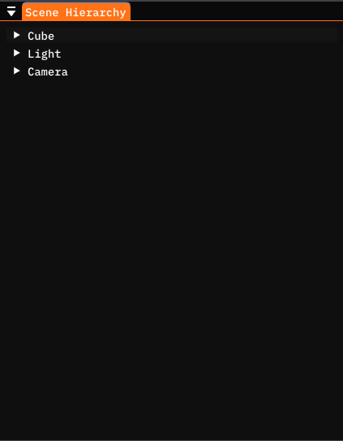

This is quite literally the hierarchy of the scene. You can see all the entities in a nice tree, select them and move them around. By clicking on the arrow next to an entity name, you will expand that entity and see all of it's children.

Children are entities who are "glued" to their parent, e.g. they move, rotate and scale with the parent. Any entity can have however many children, but an entity can only have a single, or no, parent (the top level entities have no parent).

You can also create, copy, paste and delete entities by right clicking on the empty space, or on an entity.

Creating an entity when right clicked on another entity will create the entity as a child of the clicked entity.

### Properties
When an entity is selected (whether from the Scene Hierarchy or the Viewport), the panel to the right of the Viewport, the Properties Panel, will show the selected entity's properties.

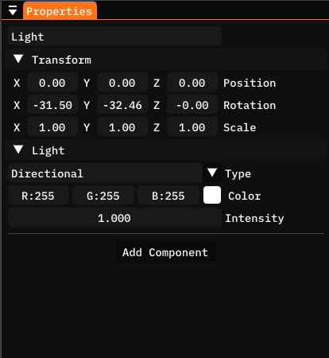

At the very top you can see and edit the entitys name, and below you will see all of the components attached to this entity alongside a button to add other components to the selected entity.

One of the most important features of the Copper-Engine is it's Entity Component System, otherwise known as an ECS. It's a system that forms a scene out of individual entites, that have very little to no functionality on their own. The functionality of the game comes from the reusable components that can be added to the entities.

You can imagine it as wall of canvases. Each canvas is an entity, on it's own, it's blank, empty and worthless, but by adding strokes of paint you can form a complex piece of art. The components are like the different colours of paint that you use to fill up the canvas.

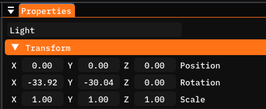

Every entity has a built in Transform component. This is what gives it it's position, rotation and scale and does all the calculations. This component also stores which entities are a child of the entity the transform is attached to, and which entity is it's parent.

#### File Mode
When a file is selected in the File Browser, the Properties panel will change to show the Properties of that file.

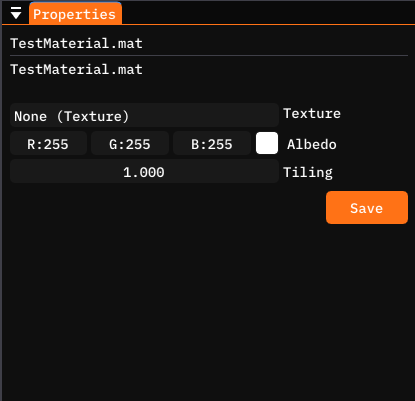

At the moment this is only used with materials, which we will discuss in a later guide. This feature will be used more in later versions of the Copper-Editor, and for most files it currently displays this message, which you can safely ignore.

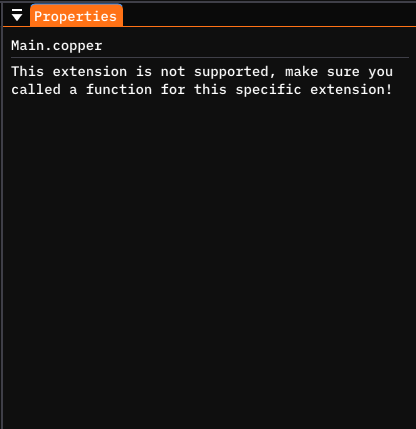

### File Browser
The File Browser is well, a file browser. It shows the contents of the Assets (Path/To/Project/Assets) directory and is where you will be storing Scenes, Scripts, Materials, and more.

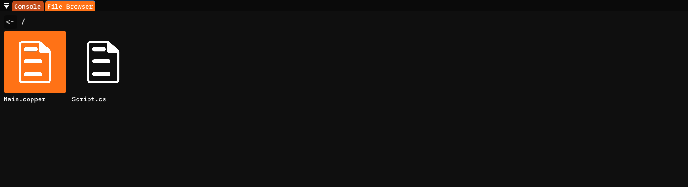

You can select, open or drag&drop files or folders from this panel. You can also right click to Create a New item, which will open up the New item modal.

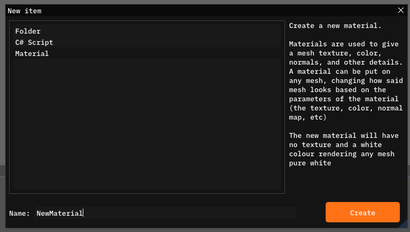

Here you can select what item to create, and also see the description of what each individual item does and is for. Once you've inputted a name (and there isn't an item with that name) the new item will be created in the current directory.

### Console
Occupying the same space is the Console panel which you can open by clickin on it's header.

This can be used for simple debugging or status updates as you can print into this console from any script. This console is also connected to the standard output so whatever you see here would be also visible in the command line.

### Camera view panel
The last panel we will talk about is the Camera view panel. Occupying the same place as the Viewport panel, you will see this.

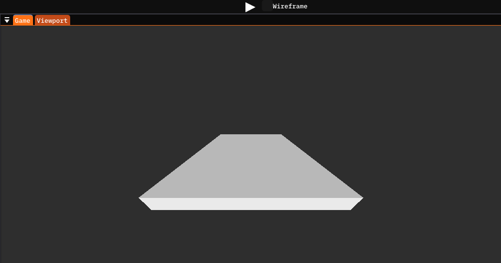

Above you can see the toolbar, where most of all you will find the Play button. By pressing it, you will "run" the game inside the editor, and in this panel you can see what the player will see when playing your game.

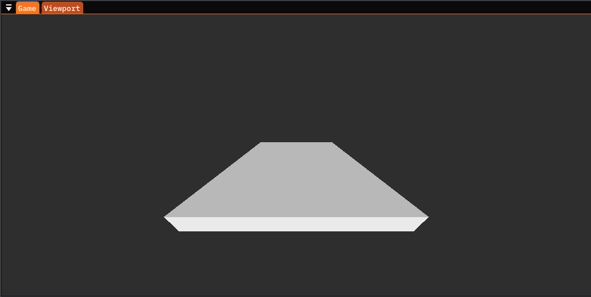

As you can see, it looks quite boring at the moment, because we haven't added any components and functionality to anything. But you will be using this panel a lot during development, once you actually start developing a game.

## Basic Terminology
Here is a list of basic terms that you will come in contact pretty frequently when using Copper-Engine:

- Scene: Scene is a level. You can have multiple scenes and switch between them at runtime. At the moment, the scene is what stores and manages the entire ECS and updates all the core systems every frame (Renderer, Physics Engine, Scripting Engine, etc).
- Entity: An entity is like an object. A Scene is made up out of many entities, which on their own do very little to nothing. Each entity can be assigned components, which is what gives the entity functionality.
- Component: Component is a class that as said previously, gives the entity functionality. You can create your own components by creating a C# script that is derived from the Component class, and override the OnBegin and OnUpdate functions to program said functionality. Example components are the RigidBody component, Light component, Transform component.
- Transform: Transform is a component that each entity has. It is what gives the entity it's position, rotation and scale, and what does all the calculations. It also stores which entities are it's parent and children.

#

- Child entity: A child entity is an entity that is parented by another entity. When the parent entity moves, rotates or scales, the same happens for the children. It is a way of gluing entities together. For instance the camera would be a child of the player entity, so that whenever the player moves, the camera moves automatically with the player.
- Parent entity: A parent entity is an entity that has any number of children entities. Those children will act relative to the parent entity, meaning if the parent moves, rotates or scales, so will all the children entities.

#

- Asset: An asset is a file that is used in the game somehow. A model, texture, audio file, etc. Copper-Engine has a powerful asset system that stores every asset in one big place, and provides safe pointers to the asset that you can use anywhere. This means that instead of every single box entity storing a copy of the box model, all of it's vertices, indices, textures, etc. The engine stores the box model somewhere in memory, and every box entity just points to the box model. This saves significant memory and performance and also makes sure that when an asset is changed, everything that uses that asset will see those changes.

## Next steps
You should now have the basic knowledge of what is the Copper-Editor. Your next steps, and the next guide, will discuss how to start coding your first component and add functionality to your game.