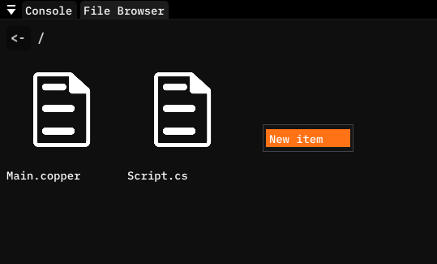
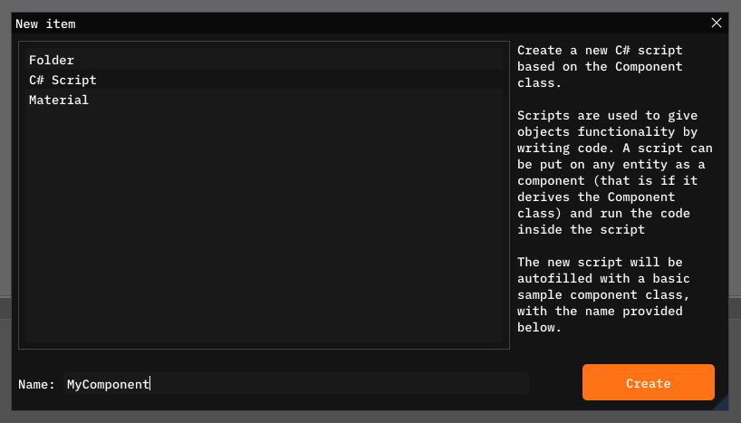
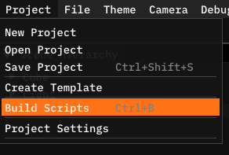
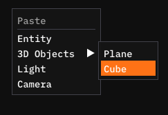
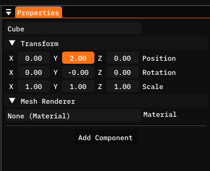
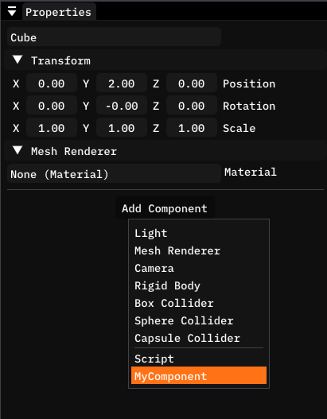
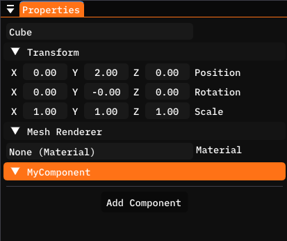
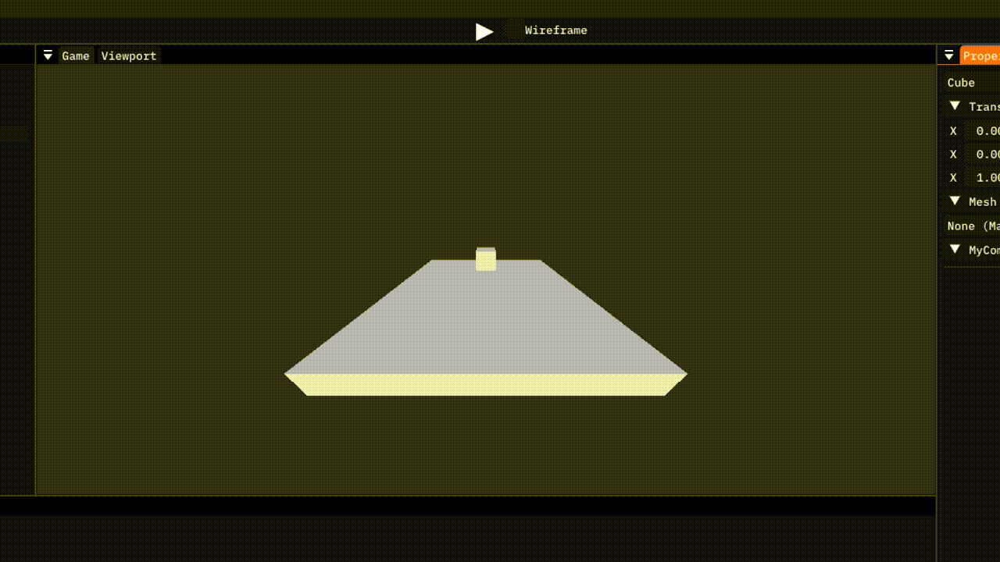
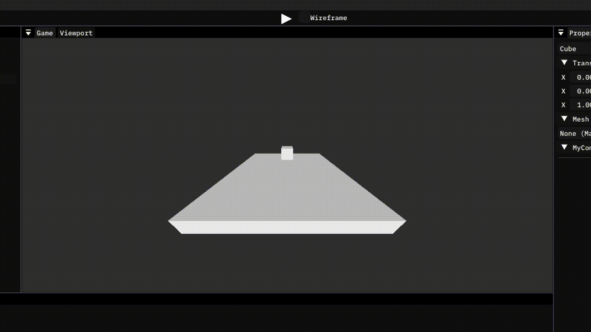

# Scripting
In the last guide, you learned about the Copper-Editor. Now it is time to use your knowledge and start coding your first Copper-Engine game.

This guide assumes that you have at least some basic coding knowledge and experience, preferably with C#, but that is not a requirement. You should at least know what is a variable, a function and a loop.

## What is Scripting
Scripting in the context of the Copper-Engine, is the act of coding your game by creating your custom components. It gives you much finer (basically infinite) control, than the Copper-Editor UI and the built in components of Copper-Engine.

Copper-Engine uses C# as it's scripting language, and provides it's own C# scripting API that lets you communicate directly with the engine. You can check out the [Scripting API reference](/docs/scriptingapi) for a more thorough explanation of every single class and function of the Scripting API.

In the future, Copper-Engine will also support C++ as a scripting language. This will be significantly faster as instead of going through an API and the mono runtime to call the engine functions, you will be able to call them directly with no overhead.
You will still be able to use C#, and even use both C# and C++ in the same project and communicate between them.

## Your first component
Start by right clicking on an empty space in the File Browser and selecting the New item option



In the New Item modal, select C# Script, give it a name, and press Create.



There should now be a new file in your Assets directory called `MyComponent.cs` (or whatever you called your component). Go ahead an open it, you should see something like this.

```cs
using System;
using Copper;

public class MyComponent : Component {

    // Called once, at the beginning of the lifetime of the Entity this component is attached to. Use for initialization
    private void OnBegin() {

        //

    }
    // Called every frame. Use for game logic
    private void OnUpdate() {

        //

    }

}
```

Tadaa, you have successfully created your first component, although it currently does nothing. Let's take a look what all of this text is.

## What kind of awesome is this
The first two lines give you access to the 2 basic namespaces. A namespace in C# is sort of like a module, it has no functionality other than to group a bunch of functions and classes together under one name.

```cs
using System;
using Copper;
```

The Copper namespace contains the entirety of the ScriptingAPI at the moment, so you wil be using it pretty often. And those lines ensure that you won't have to prefix every single line of code with `Copper.`.

The next line of code is what actually "creates" the component.

```cs
public class MyComponent : Component {
```

If you remember from the previous guide, a component is a class that is derived from the Component class. This line of code defines a new Component called MyComponent, that will now be visible in the Add Component dropdown.

If you don't know what a class is, you can think of it as a template. It defines the variables and functions this component has and now you can create however many instances of this class you want, and control them separately on their own. The `: Component` part is saying that this class is derived from the Component class, or in other words, based on it. It will have all the Component variables and functions built in, and you can call those functions from any instance of this class.

And now the last part.

```cs
    // Called once, at the beginning of the lifetime of the Entity this component is attached to. Use for initialization
    private void OnBegin() {

        //

    }
    // Called every frame. Use for game logic
    private void OnUpdate() {

        //

    }
```

These are the two update functions. They are called Update functions because they update the component in some way.

The first function, `OnBegin()`, is called on the first frame of the lifetime of the component. In other words, it is called once, at the start of the game, or the exact frame the entity was created (for entities that are created during the games runtime).
This is where you are going to initialize your component and set it up.

The second function, `OnUpdate()`, is called every single frame that the entity this component is attached to exists. This is where you are going to code your component logic. Stuff like movement, input handling, anything and everything basically.

You can remove any of these functions if you are not using them, everything will work just fine.

## Printing into the console
You can utilize the `Editor` class to print directly into the in editor Console. A hello world example would look something like this.

```cs
using System;
using Copper;

public class MyComponent : Component {

    // Called once, at the beginning of the lifetime of the Entity this component is attached to. Use for initialization
    private void OnBegin() {

        Editor.Log("Hello, world!");

    }
    // Called every frame. Use for game logic
    private void OnUpdate() {

        //

    }

}
```

## Coding
Now that you know what is what, we can start doing some simple coding. Let's start by making the entity fly upwards.

In your `OnUpdate()` function add this line of code.

```cs
transform.position += new Vector3(0.0f, 0.1f, 0.0f);
```

`transform` is a property of the `Component` class that gives you the Transform component of the entity this component is attached to. You can also get the entity this component is attached to using the `entity` property.

`Transform.position` is well, the position of the entity. It is a `Vector3`, which is just 3 floats packed into one variable for easier access. And as you can see, we are adding to it a new `Vector3` with `0.0f, 0.1f, 0.0f` as the values. The first value is the X coordinate, left to right, the second is the Y coordinate, up and down, and the third is the Z coordinate, forward and back.

Effectively, this code will make the entity move `0.1f` up every single frame.

`Transform` also contains properties like `Transform.rotation` and `Transform.scale`, which give you the rotation and scale of the entity.

## Running
Now that we have some code, let's test it out shall we ?

Open back your editor, when you do that, the code you've written should automatically compile and reload so you don't have to worry about that. If it however doesn't work, you can trigger a build and reload by pressing `CTRL + B`, or by selecting Project in the toolbar menu, and selecting Build Scripts.



Let's start by adding a Cube and setting it's Y coordinate to 2.0.





You can now click the Add Component button, and you should see your new component in there. Select it, and it should be added to the entity.



You should see a header with "MyComponent" and an arrow. Something like this.



Congratulations! You have successfully coded your first component and added it to your first entity. You can now press Play and you should see something like this.



## Delta time
Now you might have noticed that the cube flies upwards faster or slower on your computer. This is obviously unwanted behaviour, as this could lead to the player with a higher frame rate moving faster than a player with low framerate. Let's see why.

Currently, we add `0.1f` to the Y coordinate of the cube every single frame, so imagine two people. One is running this at 60FPS, and the other at 120FPS. For those unaware, FPS means frames per second, which basically means how many times per second is `OnUpdate()` called. So for person A, the cube will move up by 6 (60 * 0.1) units per second, and for person B, by 12 (120 * 0.1) units per second.

I am sure you can see the issue in that. To fix this, Copper-Engine uses a popular concept called delta time. Delta time is the time it took to render the last frame, and it is used to make sure that certain calculations like the movement of the player won't behave differently on different frame rates.

Change the your Update function to this:
```cs
private void OnUpdate() {
    
    transform.position += new Vector3(0.0f, 0.1f * Game.deltaTime, 0.0f);
    
}
```

As you can see, we use the `Game` class to retrieve the delta time, and multiply our `0.1f` by it. When you now run the game, the entity should move up 0.1 units per second, no matter how high your frame rate is.



As you can see, the cube is moving awfully slow, which is due to delta time being pretty small (At 60FPS, deltaTime is approximately `0.016f`). We could just change the code and replace `0.1f` with something larger like `2.0f`. But if  you had to change the code and rebuild the project everytime you want to change a small thing, you would go insane.

So we will fix that with variables in the next guide.

## Terminology
Here is a list of terms you should understand from reading this guide.

- Script: A C# file that is part of your project. Currently C# scripts can only be used to make your own components, but in the future they will be able to be used for many more things.

- Update function: Update functions update the component. At the moment there are only `OnBegin` and `OnUpdate` which are called the first frame and then every frame after the first one, respectively.

- Delta time: Delta time is the amount of seconds it took to render the previous frame. It is used to ensure certain frame dependent calculations like movement or animations, don't play faster at higher frame rate. The delta time can be read from `Game.deltaTime`.