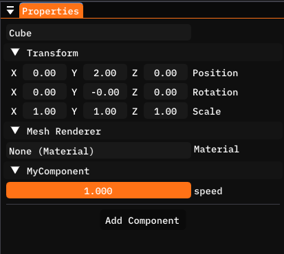
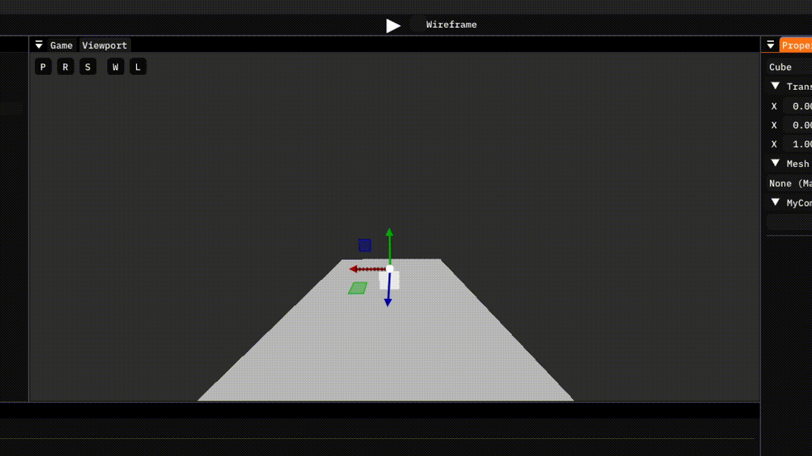
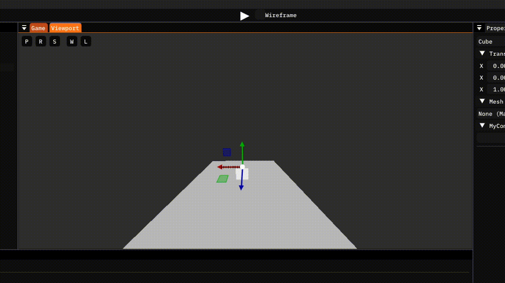
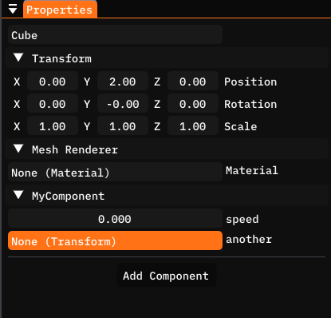
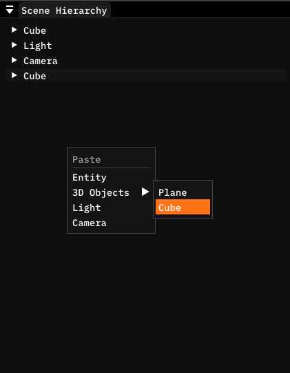
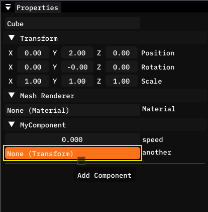
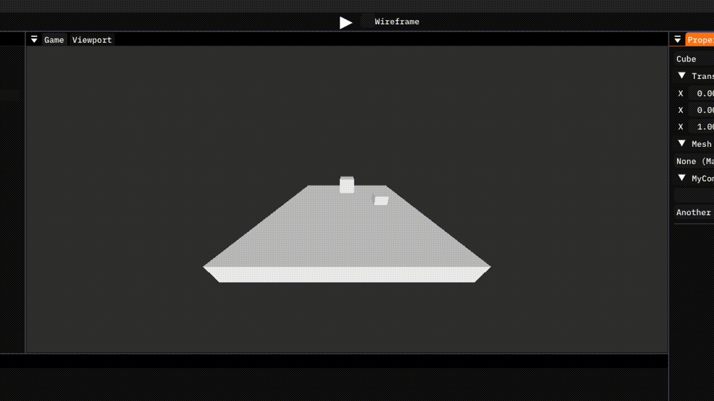

# Variables
In the last guide, we have made our first component using the Copper-Engine C# scripting engine. We have explored topics such as deltaTime, and explained the two update functions.

However we left off with our cube moving correctly, but incredibly slowly. This was due to us adding a small number multiplied by an even smaller number (`Game.deltaTime`, which at 60FPS is equal to around `0.016f`) to the Y coordinate of our cube.

```cs
transform.position += new Vector3(0.0f, 0.1f * Game.deltaTime, 0.0f);
```

Now we could multiply it by for instance `1.0f`, maybe `2.0f` and fix our problem. However I think it would be better for us to have the option to control the speed from the editor, without having to rebuild our scripts.

For this we will be using C# variables.

NOTE: This guide will use the term variable. You may be familiar with the term field in C#, which is used internally in the Copper-Engine, but this guide will be using the term variable.

## Variables
You should know what a variable in programming is, but if you don't, it's basically a box that holds something inside it, a value. In our case, we want a box that we can call `speed` and the value will be a number that determines how fast our cube moves.

Add this line of code to your C# component. Add it above the Update functions, but inside the `MyComponent` class.

```cs
public float speed = 1.0f;
```

And then change your Update function to use this variable, like this.

```cs
// Called every frame. Use for game logic
private void OnUpdate() {

    transform.position += new Vector3(0.0f, speed * Game.deltaTime, 0.0f);

}
```

Now open the editor, and select the entity you've attached your component to. You should now see the variable appear below the MyComponent header.



You can freely change this to whatever value you want, and when you press play, you should see the difference in speed.





## Variable visibility
You may have noticed that we used the word public for the speed variable. This makes it visible to everyone, and also visible in the editor by default. However this may be unwanted behaviour, as you usually want variables to be private unless it is absolutely neccessary.

To make a private variable visible in the editor, you can use the `ShowInEditor` attribute, like this.

```cs
[ShowInEditor]
private float speed = 1.0f;
```

now `speed` will be visible and editable in the editor, but inaccessible outside `MyComponent`.

You can also use the `HideInEditor` attribute to hide a public variable in editor. Not sure why you would want that.

## Reference variables
You can also use the Copper-Engine types such as `Entity` or `Transform` as variable types. You can use this to control or get some information from another entity or transform.

These variables are called reference variables, because they don't actually store the type, they just store a safe reference (usually an ID) to it.

To move another entity from your component, you can add a `Transform` variable.

```cs
[ShowInEditor]
private Transform another;
```

And use it in `OnUpdate` as well.

```cs
// Called every frame. Use for game logic
private void OnUpdate() {

    Vector3 value = new Vector3(0.0f, speed * Game.deltaTime, 0.0f);

    transform.position += value;
    another.position += value;

}
```

Now in the Properties panel, you should see the new variable show up.



It is currently invalid (it's equal to `null`), so you can assign it to a transform by dragging any entity and dropping it on top of the field. 

Let's create another cube.



And drag it from the Scene Hierarchy on top of the `Transform` variable field.



Now when you press Play, you should see two cubes moving up with the same speed.



NOTE: At the moment, Copper-Editor only supports `Entity`, `Transform` and `Material` as reference types. All other types will not show up in the Copper-Editor, but can be assigned and used in your code.

## Variable types
Here is a list of the variable types that will show up in the Copper-Editor.

- `int`
- `uint`
- `float`

#

- `Vector2`
- `Vector3`

#

- `Entity`
- `Transform`
- `Material`

NOTE: This is a very short list I know, but more types will be supported in Copper version 0.3.1.

## Terminology
Here is a list of terms you should understand after reading this guide.

- Variable: A box with a name that stores a value. Each component instance (every entity that has your component attached to it) will store it's own version. Variables can be edited from the Copper-Editor, allowing for easier control and changes, without having to recompile or rebuild anything.