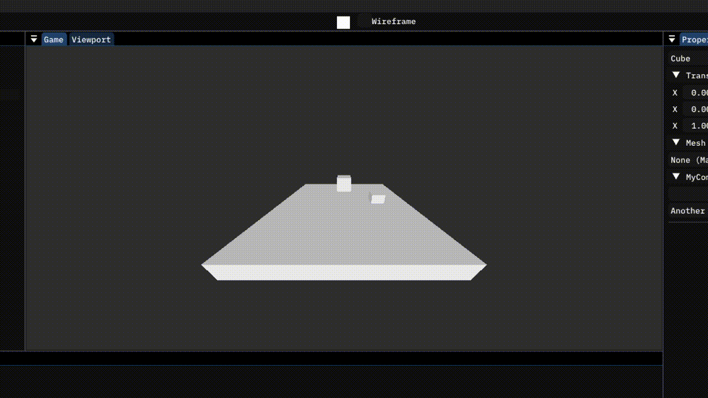
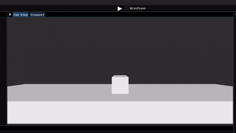

# Input system
Games are boring when the player has no way of controlling it and what is happening. So in this guide, we will fix that by learning how to work with the Copper-Engine input system.

NOTE: At the moment, Copper only supports Keyboard and mouse. Controllers, VR/XR or Phone screen controls are planned for a future future release, same with a complete rewrite into a more modern Input system.

## Copper Input System
The Copper-Engine uses a simple state based Input system. You can query the state of any given key (or mouse button) and act according to it's value (Pressed, Down, Released, None).

To use the system, we are going to use the `Input` class, and it's `GetKeyState(KeyCode key)` function. Replace your current code in `OnUpdate()` with this.

```cs
// Called every frame. Use for game logic
private void OnUpdate() {

	if (Input.GetKeyState(KeyCode.Space) == KeyState.Down) {

		Vector3 value = new Vector3(0.0f, speed * Game.deltaTime, 0.0f);

		transform.position += value;
		another.position += value;

	}

}
```

Now when you go back into the editor, select the Camera view window, click on it (important), and start the runtime, the cubes will move up only while you are holding the Spacebar, something like this.

NOTE: Input is only captured after you've clicked on the Camera view panel. By default the cursor gets hidden and locked in place. To escape this, you can press `Shift + F1`.



Congratulations, you've made your game interactible. It's still boring, but it's the smalls steps that matter.

## Rundown
`Input.GetKeyState(KeyCode key)` returns the current state (`KeyState`) of the key specified by `key`.

`KeyCode` is an enum representing a (key our mouse button) with its values being pretty self explanatory (`W`, `Space`, `MouseButton0`, etc).

`KeyState` is another enum, this time representing the state of the key. It has these 4 values:

- `KeyState.None`: Nothing, the key is not pressed at all.
- `KeyState.Pressed`: This is the first frame the key is pressed, next frame the state of the key will be `KeyState.Down` (given it isn't immediately released).
- `KeyState.Down`: The key is held down. This value will persist until the key is released.
- `KeyState.Released`: This is the frame the key was released, next frame the state of the key will be `KeyState.None`.

## Finally something interesting
Now, we have the fundamental knowledge of making a game, so let's put it to the test. Let's create a movement system for our game.

This section will be a sort of a task. The task is to create a simple side-to-side movement system. The player (a cube) should move left when the A key is pressed, and right when the D key is pressed. Please try to do this on your own, before looking at our solution. It should look something like this.



And here is our solution. Keep in mind that there can be multiple solutions, this is just the one we came up with.

```cs
using System;
using Copper;

public class PlayerMovement : Component {

    [ShowInEditor] private float speed = 1.0f;

    // Called once, at the beginning of the lifetime of the Entity this component is attached to. Use for initialization
    private void OnBegin() {

        //

    }
    // Called every frame. Use for game logic
    private void OnUpdate() {

        if (Input.GetKeyState(KeyCode.A) == KeyState.Down)
            transform.position -= new Vector3(speed * Game.deltaTime, 0.0f, 0.0f);
        if (Input.GetKeyState(KeyCode.D) == KeyState.Down)
            transform.position += new Vector3(speed * Game.deltaTime, 0.0f, 0.0f);

    }

}
```

As you can see, it only uses the basic concepts we've already talked about. We simply check the state of the A and D keys and add the speed multiplied by delta time to the x coordinate of the position.

Note that we subtract in the case the A key is held down. This is because to move to the left we need to make X go down, whereas to move to the right, we need to make X go up.

Conratulations, you've just made an input system that may be used in a side-scroller game. I think you deserve to pat yourself on the back, whether you came up with it your own or used our solution.

## Input axes
There is a way to simplify the above code, and that is using what Copper-Engine calls Input axes.

An Input axis returns -1, 0 or 1 when a key out of a pair of two keys is held. And if you look closely into our code, we could use an axis that would return -1 when A is held, and 1 when D is held. Thankfully, Copper-Engine provides some built-in axes.

Update your `OnUpdate()` function to this.

```cs
float input = Input.GetAxis("Keys_AD") * speed * Game.deltaTime;
transform.position += new Vector3(input, 0.0f, 0.0f);
```

`Input.GetAxis(string axis)` returns the value for the axis with the name equal to the value of `axis`. In this case, `"Keys_AD"` is a built-in axis that returns -1 for A and 1 for D.

When you run the game now, you should get the exact same result.

As said previously, Copper-Engine provides a few built-in axes, here is a list of them.

- Keys_AD: -1 for A, 1 for D.
- Keys_WS: -1 for S, 1 for W.

### Mouse axes
Copper-Engine also supports mouse axes. A mouse axes returns how much has the mouse moved in the given axis (direction) since last frame.

Copper-Engine provides `"Mouse_X"` for left (-1) and right (1), and `"Mouse_Y"` for up (1) and down (-1).

## Terminology
Here are some of the terms you should understand after reading this guide.

- KeyCode: An enum representing a Key or mouse button.
- KeyState: The state of a key. Can be retrieved by calling `Input.GetKeyState(KeyCode key)`.

#

- Input axis: An input axis returns -1, 0 or 1, depending on which of a pair of two keys is being held down.
- Mouse axis: Returns how much has the mouse moved in the given axis (left and right, or up and down), since the last frame. The value is between -1 and 1, and is relative to the window dimension.