# Physics
Physics are an essential part of a game since without them, the world would be static and boring and that is no bueno. Thankfully Copper-Engine provides a Physics engine, which uses PhysX for its physics simulation.

In this guide we will explore the physics system and how to use it in your games, You will learn the fundamental knowledge that we will use in the next guide to create a simple FPS movement system!

## Rigid Body physics
Rigid body physics are physics simulations where the objects do not deform under external forces, e.g. they keep their shape as if they were made out of humanity's strongest, indestructible metal.

In Copper-Engine, you can use rigid body physics by adding a, you guessed it, `RigidBody` component to any entity. This will "mark" the entity to partake in the physics simulation.

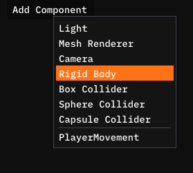

After adding a `RigidBody` component to an entity, you will see these editable fields.

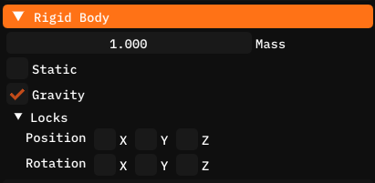

Let's quickly go over them and how to set them.

- **Mass**: Mass is how "heavy" the object is, the higher the mass, the bigger the force required to move the object. The mass is in kilograms (W Metric).
- **Static**: A rigidbody with a `true` static field can not be moved, an immovable object.
- **Gravity**: Whether the entity should be subject to gravity, this field has no real meaning when the rigidbody is set to static.
- **Locks**: Two bit masks that set whether the position or rotation should be locked around a certain axis. E.g. if you tick the X position axis, the rigidbody will not move left/right.

Now if you attempt to run the game, you will get an error like this.

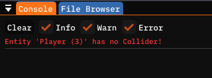

This is due to one last missing piece.

## Colliders
To simulate collisions we of course need to know the shape of the RigidBody. For this we use the `Collider` components.

In total there are 3 of them, `BoxCollider`, `SphereCollider` and `CapsuleCollider` for the three supported shapes, Box, Sphere and Capsule. Add one of these to your entity and you will see these fields.

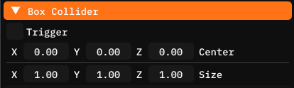

We chose the BoxCollider as our player is currently a cube, so logically it seems fitting. Anyways, here is an explanation of the `BoxCollider` fields.

- **Trigger**: A trigger collider will not block collisions, instead it will notify the entity it is on that it was intersected (a different rigidbody has entered it's shape). This is useful for things like Cutscene triggers, finish lines, etc.

- **Center**: The xyz coordinates of the center relative to the entities global position. Basically the offset of the collider.

These two are the base `Collider` fields, every collider type will have these two. And here are the type specific fields.

- **Size (BoxCollider)**: How big is the box in all three axes relative to the entity's scale (1, 1, 1 will be the same shape as the entity no matter it's scale)

#

- **Radius (SphereCollider)**: The radius of the sphere.

#

- **Radius (CapsuleCollider)**: The radius of the capsule in the xz plane.
- **Height (CapsuleCollider)**: The height of the capsule, in the y plane (up and down)

Now before running the game, we need to add a ground rigidbody entity as right now our cube would just fall down into the void.

Let's scale up the Ground entity and give it a `RigidBody` component and a `BoxCollider` component.

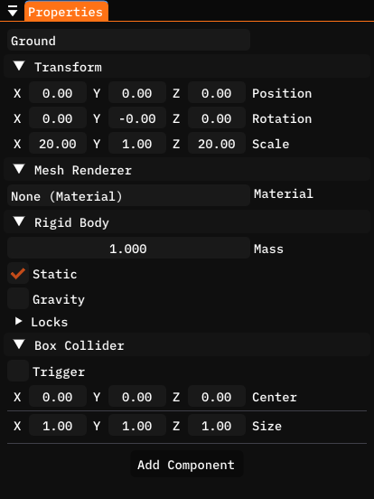

Make sure the RigidBody is set to static as we obviously don't want to ground to fall too.

And now finally, when we move the player entity into the air and run the game, you should see something like this.

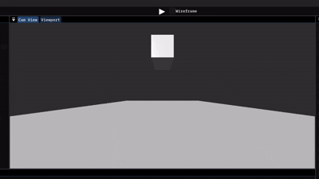

## Working with physics in C#
To use the physics system to it's fullest extent, we can work with it in C# and make it do whatever our minds come up with.

Let's start by getting the rigidbody component of our player. To do this we can use the `GetComponent<T>()` function provided by the base `Component` class. This function will return the component of type `T` on the entity this component is attached to.

```cs
private RigidBody rb = null;
	
// Called once, at the beginning of the lifetime of the Entity this component is attached to. Use for initialization
private void OnBegin() {
	
    rb = GetComponent<RigidBody>();
	
}
```

Apart from getting or setting the same fields we saw in the editor, you can also get the collider this rigidbody is using by using the `RigidBody.collider` property.

But most importantly, you can apply a force or torque to the rigidBody using the `AddForce(Vector3 force, RigidBody.ForceMode mode)` and `AddTorque(Vector3 torque, RigidBody.ForceMode mode)` functions. The `force`/`torque` parameters are the desired force/torque, and the `mode` is how the force will be applied.

`RigidBody.ForceMode` is an enum with these four values.

- **Force**: The most common choice, a simple force using the rigidbody's mass. Changes the velocity over time. Similar to Acceleration, but takes into account the mass.
- **Impulse**: Similar to force but serves as a quick impulse to the velocity (not change over time), also takes into account the mass.
- **VelocityChange**: Directly changes the velocity ignoring the rigidbody's mass.
- **Acceleration**: Also directly changes the velocity and ignores the rigidbody's mass but acts as an acceleration, e.g changes the velocity over time.

The functions use `RigidBody.ForceMode.Force` as a default parameter so in that case you don't need to worry about it.

Now to actually use the functions. Let's replace our old movement where we dirrectly modified the transform's position, we will use AddForce to use the Physics system to handle the movement.

```cs
// Called every frame. Use for game logic
private void OnUpdate() {
	
    float input = Input.GetAxis("Keys_AD");
    Vector3 force = new Vector3(input * speed, 0.0f, 0.0f);
	
    rb.AddForce(force);
	
}
```

You might notice we are no longer multiplying by `Game.deltaTime` and that is because the physics engine is already given `Game.deltaTime` and divides the force with it internally. Multiplying here would cause some weird, funky stuff.

Now when you run the game you should be ale to see something like this.

NOTE: Make sure to set the speed to a higher number than before, something like 10.

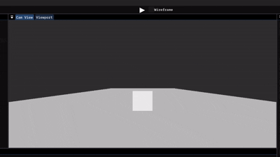

### Collider types in C#
Calling `GetComponent<Collider>()` will return any collider on the entity as the base `Collider` class. You can check which type it is using the `Collider.type` property. You can also cast the Collider into the appropriate class.

```cs
private void OnBegin() {

	Collider collider = GetComponent<Collider>();
	if (collider.type = Collider.Type.Box) {

		BoxCollider box = (BoxCollider) collider;

		// This line will result in an error as the type is not correct.
		SphereCollider sphere = (SphereCollider) collider;

	}

}
```

### Collision events
You can also receive collision events by adding these three functions to your script.

```cs
private void OnCollisionBegin(Entity other) {
	
    Editor.Log("Collision begun with: " + other.name);
	
}
private void OnCollisionPersist(Entity other) {
	
    Editor.Log("Collision persisting with: " + other.name);
	
}
private void OnCollisionEnd(Entity other) {
	
    Editor.Log("Collision ended with: " + other.name);
	
}
```

Now when you run your game, you should see something like this in the console.


To quickly go over the three functions, in each function the `Entity other` parameter is the entity the contact happened with (in this case, the ground)

- **OnCollisionBegin**: Called the same frame the collision first happens, when the contact is initiated.
- **OnCollisionPersist**: Called every frame while the contact is not broken.
- **OnCollisionEnd**: Called the frame the contact is broken.

NOTE: The function signature (return type, name and parameters) must match the ones above, otherwise they won't work.

### Trigger events
And last but not least, you can also receive events when a trigger was entered or left using the `OnTriggerEnter(Entity other)` and `OnTriggerLeft(Entity other)` functions.

For this let's create a new test component called `TriggerTest`, then add these 2 functions to the component.

```cs
private void OnTriggerEnter(Entity other) {
	
    Editor.Log("Trigger entered by: " + other.name);
	
}
private void OnTriggerLeave(Entity other) {
	
    Editor.Log("Trigger left by: " + other.name);
	
}
```

Now in the editor, let's create a new empty entity and add a `RigidBody` component, `BoxCollider` component, and the new `TriggerTest` component.

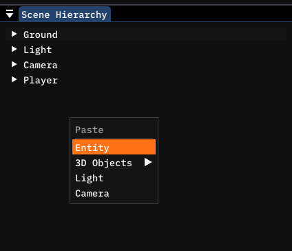

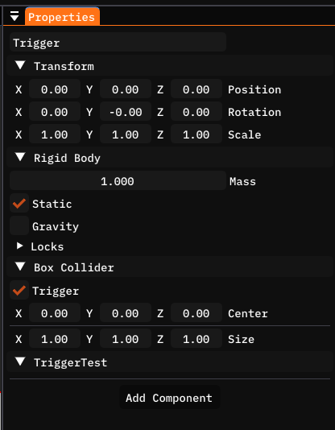

Don't forget to mark the RigidBody as static with no gravity, and the collider as a trigger.

Now move it up and either to the left or right of the player, like this.

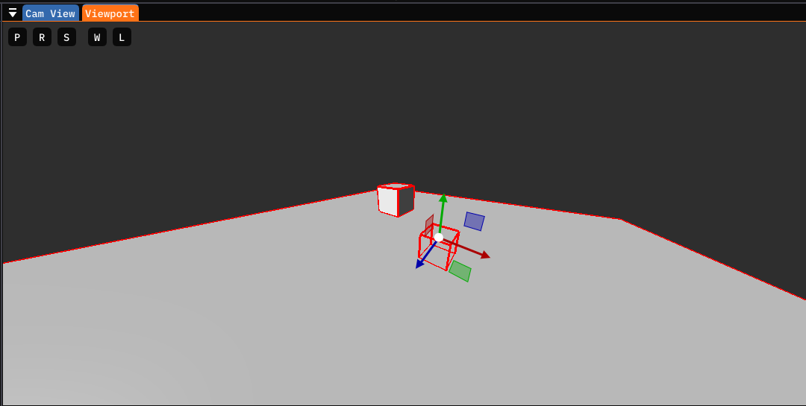

And now when you run the game and run into and out of it you should see something like this in the console.

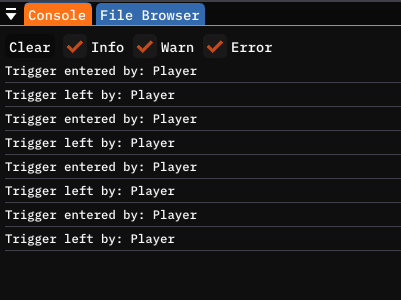

## Recap
This one was a long one right ?

To recap, we learned how to make our entities partake in the Physics simulation, how to manipulate them through code and lastly how to receive Collision and Trigger events from the Physics system.

You've now got the fundamental knowledge to create an FPS movement system, which we will do in the next guide!

## Terminology
Here are some of the terms you should now understand.

- **RigidBody**: A component that marks an entity to partake in the Physics simulation. It stores the mass, whether it's static, has gravity and lastly the Position and Rotation locks.
- **Collider**: A component that gives a RigidBody the shape. There are multiple built-in Collider shapes. An entity needs both a `RigidBody` component and a `Collider` component to partake in the physics simulation, having just one of them will result in an error.

#

- **Trigger**: A trigger is a collider that has the trigger field ticked as true, in which case instead of blocking all entities and acting as hard solid volume, it lets them go right through and hang out inside the trigger volume, firing events for when an object enters or leaves said volume.