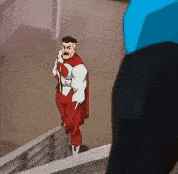
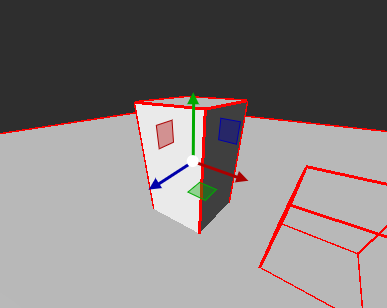
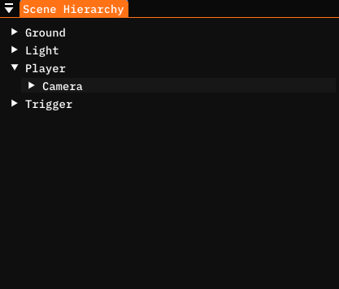
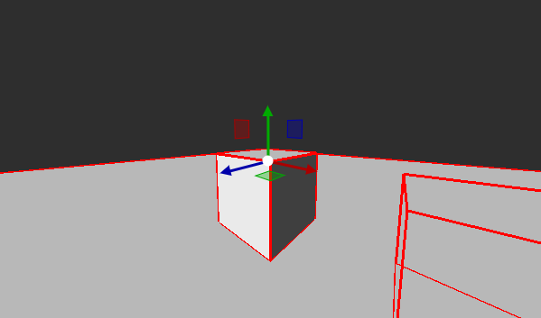
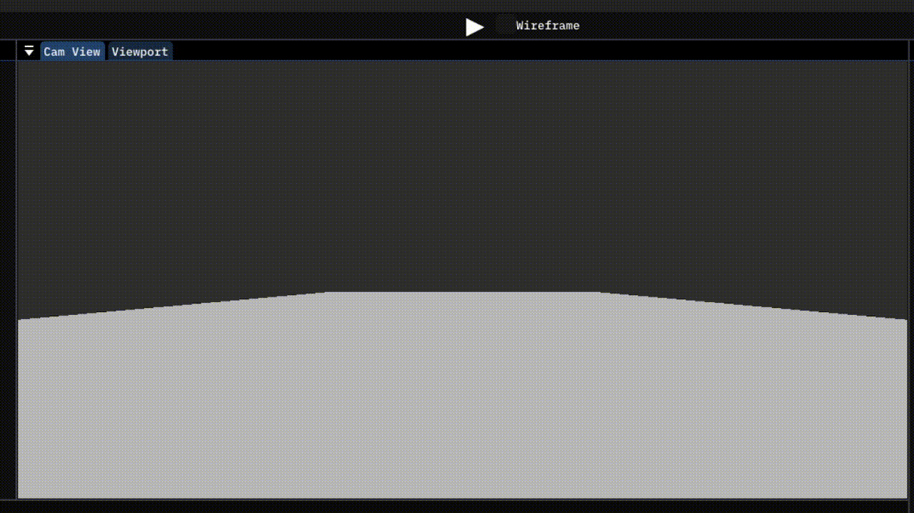
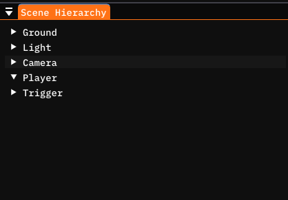
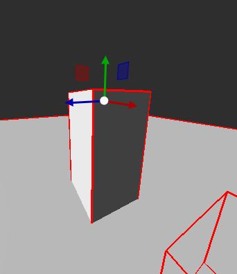

# First person Movement
In the last guide we've learned how to use the Physics system, the last part we need to create something interesting, a First Person movement system.

Let's get right to it.

## Breakdown.
Let's break down the problem into smaller ones.



1. We want to listen to the keyboard and mouse input, specifically the WASD keys and the mouse movement.
2. Based on the input, we want to add a force to the `RigidBody` component and rotate the player and camera.

Thankfully, we have the knowledge for both of these tasks from the previous 2 guides.

## 1. Input
Let's start with an empty Component that we will call `PlayerMovement` but you are free to call it whatever you want.

```cs
using System;
using Copper;

public class PlayerMovement : Component {

    // Called once, at the beginning of the lifetime of the Entity this component is attached to. Use for initialization
    private void OnBegin() {

        //

    }
    // Called every frame. Use for game logic
    private void OnUpdate() {

        //

    }

}
```

First we're going to need to add these 4 variables to our component.

```cs
[ShowInEditor] private float speed = 1.0f;
[ShowInEditor] private float sensitivity = 1.0f;

[ShowInEditor] private Transform camera = null;
private RigidBody rb = null;
```

`speed` and `sensitivity` are pretty self explanatory, they will control how fast the player moves and how sensitive the looking around is to mouse movement.

`camera` is the `Transform` component of the camera entity. We need this reference because the Camera will most likely be a separate entity, not the same one this component will be on. And lastly, `rb` is a the `RigidBody` we want to actually move.

From the Input guide, you may remember that instead of a bunch of if statements whether W or S is pressed, A or D, etc, we can use an input axis which returns a number from -1 to 1 depending on which one of a pair of keys was pressed.

Additionally, Copper-Engine provides the 2 mouse input axes, which return how much has the mouse moved since last frame.

Add this piece of code to your Update function.

```cs
// Called every frame. Use for game logic
private void OnUpdate() {

    // Move

    float x = Input.GetAxis("Keys_AD");
    float y = Input.GetAxis("Keys_WS");

    // Look

    float mouseX = Input.GetMouseAxis("Mouse X");
    float mouseY = Input.GetMouseAxis("Mouse Y");

}
```

NOTE: Make sure that the axis name is exaclty the same (lettercase matters too).

And this is it for the input section. It is surprisingly easy, but this is all that you need at the moment.

## 2. Physics
We first need to get a reference to the `RigidBody` component we want to move. You can do this in the `OnBegin()` method.

```cs
// Called once, at the beginning of the lifetime of the Entity this component is attached to. Use for initialization
private void OnBegin() {

	rb = GetComponent<RigidBody>();

}
```


### Keyboard input
Now that we have both the `RigidBody` and the keyboard input, we can connect the two together.

First we need to calculate the force which we want to apply to `rb`. Your initial assumptions might be something like this.

```cs
Vector3 force = Vector3.right * x + Vector3.forward * y;
```

While this may appear like it works, it will break once we introduce looking around, as this will always move along the x or z axis no matter which way we are looking.

This solution isn't far from the correct one, that looks like this.

```cs
Vector3 force = transform.right * x + transform.forward * y;
```

This introduces the directional vectors of the transform component.

#### Directionals
Copper-Engine provides you with the 3 directional vectors of a transform component, `transform.forward`, `transform.right` and `transform.up`. These are unit vetors that point towards the three directions based on the rotation of the transform.

You already worked with these, in the gizmos when you select an entity and have the position tool selected.



`transform.forward`, `transform.right` and `transform.up` point in the same directions as these three arrows.

#

Back on topic, the force calculation solution should be intuitive to you hopefully. We are multiplying each direction with the input axis "paired" with that direction.

Now this force equation is not done yet, this is just the direction we want to move in. But before we continue, we need to normalize the direction.

#### Vector normalization

Imagine the scenario where the Player holds both the W and D key at the same time. `x` and `y` will both be equal to one, therefore the force equation will result to:

```cs
Vector3 force = transform.right * 1 + transform.forward * 1;
```

Or

```cs
Vector3 force = transform.right + transform.forward;
```

Which will result in a force vector of `(1, 0, 1)`. If you would to take the length of the Vector3 (Pythagorean theorem), it wouldn't be 1 but instead `1.41` (square root of 2).

Which would result in the player moving faster while holding two input keys, which is, in most cases, not what you want.

For that reason, we need to Normalize the vector, or in other words, modify it so that it's length is equal to 1, while keeping it's direction. Thankfully, the `Vector3` struct has a function just for that.

```cs
force.Normalize();
```

After this, the last step we need to do is to actually add this force to the `RigidBody`. Just like this.

```cs
rb.AddForce(force * speed);
```

And we're done with this step! We can now move to the mouse input stage. This is what your `OnUpdate()` function should look like by now.

```cs
// Called every frame. Use for game logic
private void OnUpdate() {

	// Move

	float x = Input.GetAxis("Keys_AD");
	float y = Input.GetAxis("Keys_WS");

	Vector3 force = transform.right * x + transform.forward * y;
	force.Normalize();
	rb.AddForce(force * speed);

	// Look

	float mouseX = Input.GetMouseAxis("Mouse X");
	float mouseY = Input.GetMouseAxis("Mouse Y");

}
```

### Mouse input
Let's start by adding variables to store the pitch and yaw (x and y rotation). We do this just because it's easier to construct the rotation quaternion from scratch instead of adding or subtracting to it.

NOTE: I am not even sure if approaching this by adding or subtracting to the rotation is possible lol

```cs
private float pitch = 0.0f;
private float yaw = 0.0f;
```

We can now slightly modify the `OnUpdate()` function to modify these variables.

```cs
pitch -= Input.GetMouseAxis("Mouse X") * sensitivity * Game.deltaTime;
yaw -= Input.GetMouseAxis("Mouse Y") * sensitivity * Game.deltaTime;
```

Here we do multiply by `Game.deltaTime` to make the sensitivity frame consistent. We don't do that in the keyboard input section because the force we add to `rb` is multiplied by `Game.deltaTime` by the Physics engine.

Now we can modify the rotations. We need to individually rotate the player around the Y axis (left-right) and the camera around the X axis (up-down). This is because we obviously don't want to rotate the whole player body up and down. We could technically rotate just the camera around both axis but then the player model would be statically oriented.

```cs
transform.rotation = new Quaternion(0.0f, pitch, 0.0f);
camera.rotation = new Quaternion(yaw, 0.0f, 0.0f);
```

#### PROBLEM
This would normally work in most engines and games, and it does in Copper. Unless the parent of the camera has a non uniform scale (different values in each axis) that is.

Normally you would make the camera a child of the player entity, which is why you only have to set the yaw because it inherits the pitch from the parent. However in our example, the player has a scale of `1, 2, 1` which introduces some very weird roll (Z-axis) rotation for the camera.

NOTE: This is technically not a bug. It comes from how the rotation is calculated and applied in the `Transform` component. This will be fixed in the future, pinky promise.

#### Uniform scale
If your player entity has a uniform scale (all 3-axis are equal) you can now move to the Copper-Editor and make the camera a child of the player. Don't forget to set the camera field of the component to the camera entity.

NOTE: If you see no movement, make sure your `speed` and `sensitivity` values are not too small. We used the values `10.0` and `10.0`.



We also recommend moving the camera slightly up as to not be in the center of the player's body.



Now when you run the game, you should have a working First Person movement system!



#### Non-uniform scale
If your Player entity has a non uniform scale (e.g. `1, 2, 1)`, we need to rotate around both the X and Y axis, alongside moving the camera to match the X and Z position of the player since the camera can not be a child of the player entity.

```cs
camera.rotation = new Quaternion(yaw, pitch, 0.0f);
camera.position = new Vector3(transform.position.x, camera.position.y, transform.position.z);
```

Now when you go to the Copper-Editor, position the camera to where the eyes of the player would be and make sure it isn't a child of the parent.






And when you run the game, you should have a working First Person movement system!


## Full code
Here is the full code from this tutorial, please check the bottom section of `OnUpdate()` and use the version that fits your usecase better.

```cs
using System;
using Copper;

public class PlayerMovement : Component {

    [ShowInEditor] private float speed = 1.0f;
    [ShowInEditor] private float sensitivity = 1.0f;

    [ShowInEditor] private Transform camera = null;
    private RigidBody rb = null;

    float yaw = 0.0f;
    float pitch = 0.0f;

    // Called once, at the beginning of the lifetime of the Entity this component is attached to. Use for initialization
    private void OnBegin() {

        rb = GetComponent<RigidBody>();

    }
    // Called every frame. Use for game logic
    private void OnUpdate() {

        // Move

        float x = Input.GetAxis("Keys_AD");
        float y = Input.GetAxis("Keys_WS");

        Vector3 force = transform.right * x + transform.forward * y;
        force.Normalize();
        rb.AddForce(force * speed);

        // Look

        pitch -= Input.GetMouseAxis("Mouse X") * sensitivity * Game.deltaTime;
        yaw -= Input.GetMouseAxis("Mouse Y") * sensitivity * Game.deltaTime;

        transform.rotation = new Quaternion(0.0f, pitch, 0.0f);

        // If your player entity (the body) has a unfirom scale (e.g. 1, 1, 1), you can use this version if the camera is a child
        // of the player entity
        // camera.rotation = new Quaternion(yaw, 0.0f, 0.0f);

        // If your player entity (the body) has a non uniform scale (not all ones), you have to use this version
        // Make sure the camera is NOT a child of the player entity.
        camera.rotation = new Quaternion(yaw, pitch, 0.0f);
        camera.position = new Vector3(transform.position.x, camera.position.y, transform.position.z);

    }

}
```

## Recap
In this guide, we used the knowledge from the previous 2 guides to connect the Input and the Physics system together and formed a First Person movement system.

We calculated the direction which the player should move in, normalized it and applied it as a force to the `RigidBody` component. We then used the mouse movement to set the rotation of the Player and camera entities.

## Terminology
Here are some of the terms you should now understand.

- **Normalize**: To normalize a vector is to modify it so that it's length is equal to exactly one while keeping it pointing in the same direction.

#

- **Uniform**: For something to be the exact same along multiple values, axes, etc. A uniform scale is something like `1, 1, 1` or `2, 2, 2`.
- **Non Uniform**: Exact opposite of Uniform, at least one of the values, axes, etc is different than the rest. `1, 2, 3` and `1, 2, 1` are an example of a non uniform scale.