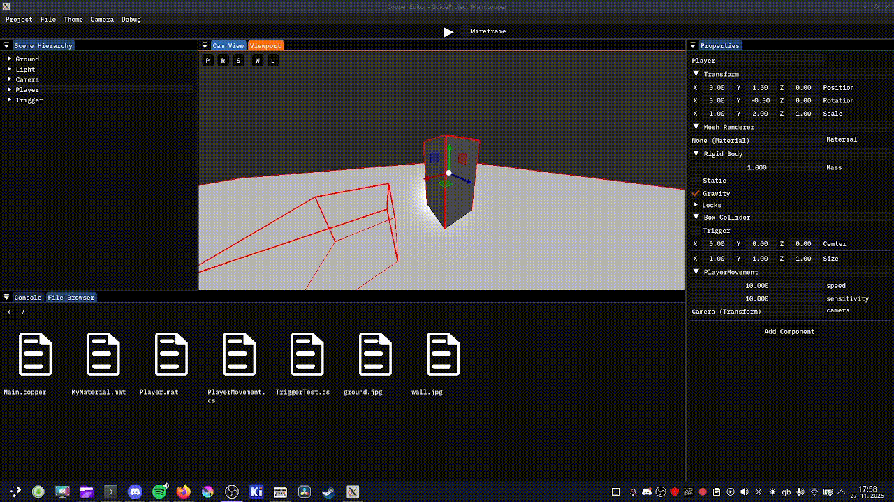
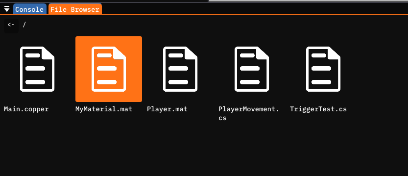
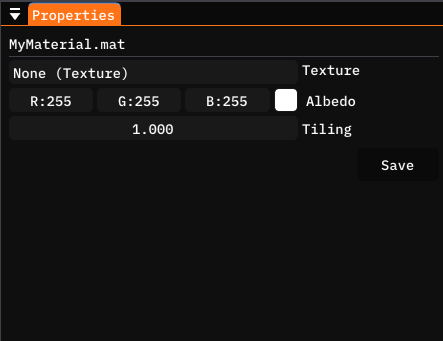
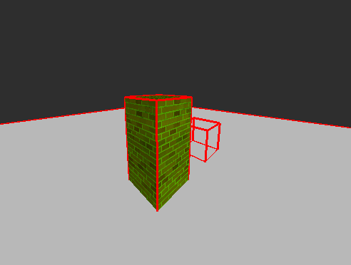
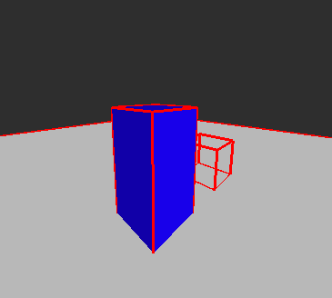
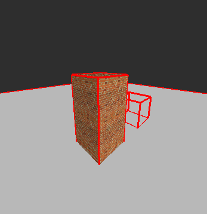
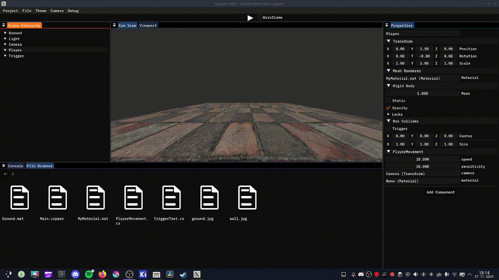

# Materials
Are you bored of your game's models being all white and boring ? Do you want to add some pizzazz to your game ? Well Materials are the thing for you!

A Material is an asset that defines the visual side of a mesh, e.g. it's color, texture, etc. You can apply a material to any `MeshRenderer` component.

## Creating your first material
Creating a material is incredibly simple. You can use the New Item modal by right clicking on an empty space in the File browser window.


Here you can selec the Material option, give it a name an click Create.


A file with the name of the material should've now appeared in the File browser.

To apply a material, you can select the entity you want to apply it to, grab and drag the material and drop it onto the `material` field of the `MeshRenderer` component.



However, you will notice that nothing has changed. This is because we have not modified the material in any way and by default every material has the same properties as the default material, which is all white.

To edit the material, select the material in the File Browser and observe the Properties panel.






Here you can see and modify the material properties. Copper-Engine currently provides 3 properties you can edit.

### Texture
A texture is an image that gets "painted" over the mesh. It gives the mesh a more unique and detailed look than just a plain color.

To set this field, add any picture to the `Assets` folder of your project. It should now appear in the FileBrowser. You can now grab and drag this file onto the field to set the texture of the material.


### Albedo
Albedo is the color the texture will be multiplied with.

By default this value is White, which will keep the texture untouched. Modifying it will give the texture a hue of the color.



In the case the material has no texture, Albedo acts as a sort of color property. E.g. whatever color albedo is set to will be the exact color of the material.



### Tiling
And lastly, tiling.

Tiling is how much should the texture be tiled. It acts as a sort of zoom property where a value above 1 will zoom the texture out.



And a value below one will zoom the texture in.


## Materials in C#
You can add `Material` fields to your C# scripts to modify an existing material.

```cs
[ShowInEditor] private Material material = null;
```

You can now drag and drop a material onto the field to set it's value.



However, only the `albedo` and `tiling` fields are editable. Unfortunately Textures would require a overhaul of the current Texture system, which will be done soon, I promise, fr fr ong.

```cs
material.albedo = Color.red;
material.tiling = 10.0f;
```

However, currently this is not recommend as when you make changes to a material in code, those changes will stick until you close and reopen the Copper-Editor.

You can also set a `MeshRenderer`'s material through code like this.

```cs
GetComponent<MeshRenderer>().material = material;
```

This does get reset when you stop the runtime, unlike modifying the material itself.

## Recap
In this super quick guide we learned what a material is, how to create and modify one and how to use them.

## Terminology
Here are some of the terms you should now understand.

- **Material**: A Material is an asset that defines the visual properties of a surface. You can apply any material to any mesh, through the `MeshRenderer` component, giving that mesh those surface properties.

# 

- **Texture**: A texture is an image that gives a surface more details.
- **Albedo**: Albedo is the color the material's Texture will be multiplied by. If the material has no texture, this will be the defacto color of the surface.
- **Tiling**: Tiling is a sort of zoom factor of the texture. A value below 1 will zoom in and a value above 1 will zoom out the texture, repeating it multiple times.